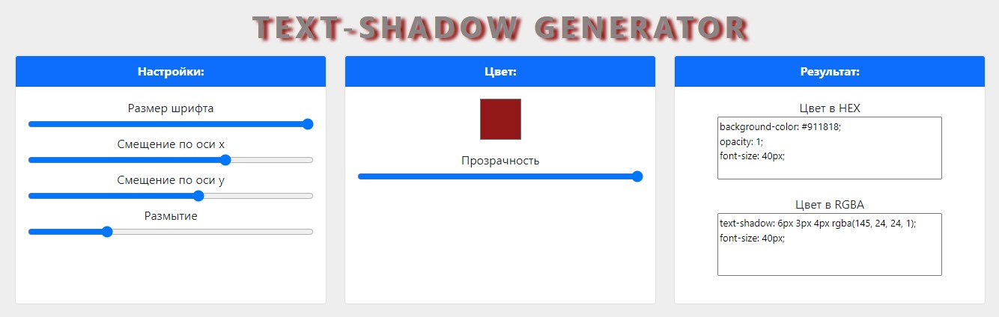

# Генератор тени CSS

### Хостинг через GitHub pages: https://mesanyaa.github.io/Text-shadow-generator/

#### Описание проекта

Данное веб-приложение является генератором свойства text-shadow для CSS. Пользователь может самостоятельно выбрать размер шрифта, смещение по осям x/y, размытие, цвет и прозрачность тени. На выходе пользователь получает готовый CSS-код с нужной тенью.

#### Интерфейс приложения 

#### Используемые технологии

- HTML, CSS, JavaScript
- jQuery
- Bootstrap
